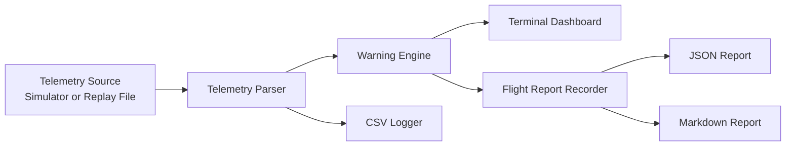

# Architecture: UAV Telemetry Ground Station

This project is a simulated UAV ground-station workflow for telemetry monitoring, warning-state evaluation, logging, replay, and post-run reporting.

It is intentionally built with simulated telemetry first so the logic can be tested safely before connecting to live MAVLink/PX4/ArduPilot telemetry.

## Data flow

## Main components

| Component | Purpose |
|---|---|
| `telemetry_generator.py` | Generates repeatable UAV scenarios such as normal flight, GPS loss, low battery, unsafe armed state, link loss, and mixed faults. |
| `telemetry_parser.py` | Defines the telemetry frame structure used across the project. |
| `warning_engine.py` | Evaluates each telemetry frame and produces safety/warning states. |
| `dashboard.py` | Displays operator-facing telemetry in the terminal. |
| `logger.py` | Writes telemetry to CSV and replays CSV/JSONL logs. |
| `flight_report.py` | Aggregates telemetry, counts warnings, determines final safety status, and writes JSON/Markdown reports. |
| `main.py` | Command-line entry point for simulate and replay modes. |

## Warning states

The warning engine currently detects:

- `LOW_BATTERY`
- `CRITICAL_BATTERY`
- `GPS_LOST`
- `LOW_SATELLITE_COUNT`
- `ARMED_WITH_BAD_GPS`
- `HIGH_CURRENT_DRAW`
- `LOW_LINK_QUALITY`
- `RANGEFINDER_TOO_CLOSE`
- `SENSOR_FAULT`
- `TELEMETRY_TIMEOUT` / stale telemetry

## Safety status logic

The flight report summarizes the run as:

| Status | Meaning |
|---|---|
| `NOMINAL` | No warnings were detected. |
| `CAUTION` | Non-critical warnings occurred and should be reviewed. |
| `UNSAFE` | High-risk warnings occurred, such as critical battery, high current, bad GPS while armed, sensor fault, or telemetry timeout. |
| `NO_DATA` | No telemetry frames were recorded. |

## Future live integration path

Planned next steps for real UAV integration:

1. Add MAVLink telemetry input using a serial radio or UDP endpoint.
2. Map MAVLink messages into the internal `TelemetryFrame` structure.
3. Replay real flight logs through the same warning/reporting pipeline.
4. Add configurable thresholds for different airframes and battery packs.
5. Add an operator UI or web dashboard for field testing.
